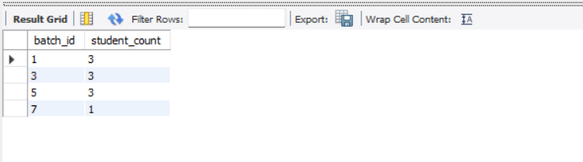
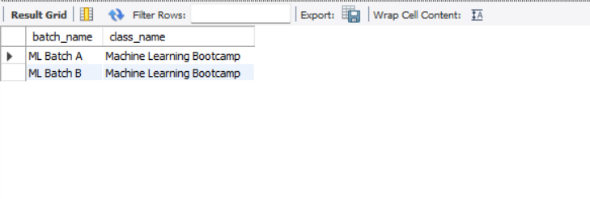
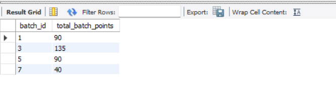
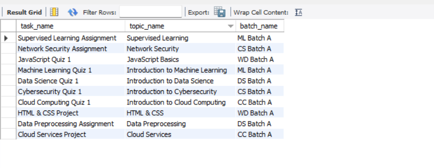

## Design DB model for Guvi Zen class

**Entities:**
   - student
   - class
   - batch
   - topic
   - task
   - leaderboard
   - mentors

**Relationships:**
   - A Class can have multiple Batches.
   - A Batch can have multiple Students and vice versa.
   - A Class can have multiple Topics.
   - A Batch can have multiple Tasks.
   - A Task is associated with a Topic.
   - A Batch can have multiple entries in the Leaderboard.
   - A Mentor can be associated with multiple Classes and vice versa. 

**Creating the tables for entities:**
   
**Student table**

    CREATE TABLE Student (
            student_id INT PRIMARY KEY AUTO_INCREMENT,
            name VARCHAR(255) NOT NULL,
            email VARCHAR(255) UNIQUE NOT NULL,
            enrollment_date DATE);

**class table**

    CREATE TABLE Class (
            class_id INT PRIMARY KEY AUTO_INCREMENT,
            class_name VARCHAR(255) NOT NULL,
            description TEXT,
            start_date DATE,
            end_date DATE);

**Batch table**

    CREATE TABLE Batch (
            batch_id INT PRIMARY KEY AUTO_INCREMENT,
            class_id INT,
            batch_name VARCHAR(255) NOT NULL,
            start_date DATE,
            end_date DATE,
            FOREIGN KEY (class_id) 
            REFERENCES Class(class_id));

**Topic table**

    CREATE TABLE Topic (
            topic_id INT PRIMARY KEY AUTO_INCREMENT,
            class_id INT,
            topic_name VARCHAR(255) NOT NULL,
            description TEXT,
            week_number INT,
            FOREIGN KEY (class_id) 
            REFERENCES Class(class_id));

**Task table**

    CREATE TABLE Task (
            task_id INT PRIMARY KEY AUTO_INCREMENT,
            batch_id INT,
            topic_id INT,
            task_name VARCHAR(255) NOT NULL,
            description TEXT,
            due_date DATE,
            points INT,
            FOREIGN KEY (batch_id) 
            REFERENCES Batch(batch_id),
            FOREIGN KEY (topic_id) 
            REFERENCES Topic(topic_id));

**Leaderboard table**

    CREATE TABLE Leaderboard (
            leaderboard_id INT PRIMARY KEY AUTO_INCREMENT,
            batch_id INT,
            student_id INT,
            total_points INT,
            FOREIGN KEY (batch_id) 
            REFERENCES Batch(batch_id),
            FOREIGN KEY (student_id) 
            REFERENCES Student(student_id));

**Mentor table**

    CREATE TABLE Mentor (
            mentor_id INT PRIMARY KEY AUTO_INCREMENT,
            name VARCHAR(255) NOT NULL,
            email VARCHAR(255) UNIQUE NOT NULL,
            specialization VARCHAR(255));      

**Mentor_Class table**

    CREATE TABLE Mentor_Class (
            mentor_id INT,
            class_id INT,
            PRIMARY KEY (mentor_id, class_id),
            FOREIGN KEY (mentor_id) 
            REFERENCES Mentor(mentor_id),
            FOREIGN KEY (class_id) 
            REFERENCES Class(class_id));  

**Student_Batch table**

    CREATE TABLE Student_Batch (
            student_id INT,
            batch_id INT,
            PRIMARY KEY (student_id, batch_id),
            FOREIGN KEY (student_id) 
            REFERENCES Student(student_id),
            FOREIGN KEY (batch_id) 
            REFERENCES Batch(batch_id)); 

**Inserting the date for all tables:**         

**Student table**

    INSERT INTO Student (name, email, enrollment_date) VALUES
                ('Alice Johnson', 'alice.johnson@example.com', '2023-01-10'),
                ('Bob Smith', 'bob.smith@example.com', '2023-02-15'),
                ('Charlie Brown', 'charlie.brown@example.com', '2023-03-20'),
                ('David Williams', 'david.williams@example.com', '2023-01-18'),
                ('Emma Wilson', 'emma.wilson@example.com', '2023-02-25'),
                ('Fiona Clark', 'fiona.clark@example.com', '2023-03-30'),
                ('George Hill', 'george.hill@example.com', '2023-01-22'),
                ('Hannah Lewis', 'hannah.lewis@example.com', '2023-02-28'),
                ('Ian Thompson', 'ian.thompson@example.com', '2023-03-25'),
                ('Jack Martinez', 'jack.martinez@example.com', '2023-04-05');

**class table**

    INSERT INTO Class (class_name, description, start_date, end_date) VALUES
                ('Data Science Bootcamp', 'An intensive bootcamp on data science', '2023-04-01', '2023-10-01'),
                ('Web Development Bootcamp', 'Learn full stack web development', '2023-05-01', '2023-11-01'),
                ('Machine Learning Bootcamp', 'Deep dive into machine learning', '2023-06-01', '2023-12-01'),
                ('Cloud Computing Bootcamp', 'Introduction to cloud computing', '2023-07-01', '2024-01-01'),
                ('Cybersecurity Bootcamp', 'Fundamentals of cybersecurity', '2023-08-01', '2024-02-01'),
                ('AI Bootcamp', 'Learn about artificial intelligence', '2023-09-01', '2024-03-01'),
                ('Blockchain Bootcamp', 'Understanding blockchain technology', '2023-10-01', '2024-04-01'),
                ('DevOps Bootcamp', 'Learn DevOps practices', '2023-11-01', '2024-05-01'),
                ('Data Engineering Bootcamp', 'Data engineering skills', '2023-12-01', '2024-06-01'),
                ('Big Data Bootcamp', 'Handling big data', '2024-01-01', '2024-07-01');

**Batch table**

    INSERT INTO Batch (class_id, batch_name, start_date, end_date) VALUES
                (1, 'DS Batch A', '2023-04-01', '2023-07-01'),
                (1, 'DS Batch B', '2023-07-01', '2023-10-01'),
                (2, 'WD Batch A', '2023-05-01', '2023-08-01'),
                (2, 'WD Batch B', '2023-08-01', '2023-11-01'),
                (3, 'ML Batch A', '2023-06-01', '2023-09-01'),
                (3, 'ML Batch B', '2023-09-01', '2023-12-01'),
                (4, 'CC Batch A', '2023-07-01', '2023-10-01'),
                (4, 'CC Batch B', '2023-10-01', '2024-01-01'),
                (5, 'CS Batch A', '2023-08-01', '2023-11-01'),
                (5, 'CS Batch B', '2023-11-01', '2024-02-01');

**Topic table**

    INSERT INTO Topic (class_id, topic_name, description, week_number) VALUES
                (1, 'Introduction to Data Science', 'Overview of data science concepts', 1),
                (1, 'Data Preprocessing', 'Data cleaning and preprocessing techniques', 2),
                (2, 'HTML & CSS', 'Building static web pages with HTML and CSS', 1),
                (2, 'JavaScript Basics', 'Introduction to JavaScript programming', 2),
                (3, 'Introduction to Machine Learning', 'Overview of machine learning', 1),
                (3, 'Supervised Learning', 'Techniques for supervised learning', 2),
                (4, 'Introduction to Cloud Computing', 'Basics of cloud computing', 1),
                (4, 'Cloud Services', 'Overview of cloud service providers', 2),
                (5, 'Introduction to Cybersecurity', 'Fundamentals of cybersecurity', 1),
                (5, 'Network Security', 'Understanding network security', 2);

**Task table**

    INSERT INTO Task (batch_id, topic_id, task_name, description, due_date, points) VALUES
                (1, 1, 'Data Science Quiz 1', 'Quiz on introductory data science concepts', '2023-04-15', 10),
                (1, 2, 'Data Preprocessing Assignment', 'Clean and preprocess the given dataset', '2023-04-22', 20),
                (3, 3, 'HTML & CSS Project', 'Create a personal portfolio website', '2023-05-15', 30),
                (3, 4, 'JavaScript Quiz 1', 'Quiz on JavaScript basics', '2023-06-01', 15),
                (5, 5, 'Machine Learning Quiz 1', 'Quiz on introductory machine learning concepts', '2023-06-15', 10),
                (5, 6, 'Supervised Learning Assignment', 'Implement a supervised learning algorithm', '2023-06-22', 20),
                (7, 7, 'Cloud Computing Quiz 1', 'Quiz on cloud computing basics', '2023-07-15', 10),
                (7, 8, 'Cloud Services Project', 'Setup a cloud service', '2023-07-22', 20),
                (9, 9, 'Cybersecurity Quiz 1', 'Quiz on cybersecurity basics', '2023-08-15', 10),
                (9, 10, 'Network Security Assignment', 'Implement network security measures', '2023-08-22', 20);

**Leaderboard table**

    INSERT INTO Leaderboard (batch_id, student_id, total_points) VALUES
                (1, 1, 30),
                (1, 2, 25),
                (1, 3, 35),
                (3, 4, 45),
                (3, 5, 40),
                (3, 6, 50),
                (5, 7, 30),
                (5, 8, 35),
                (5, 9, 25),
                (7, 10, 40);

**Mentor table**

    INSERT INTO Mentor (name, email, specialization) VALUES
                ('Dr. John Doe', 'john.doe@example.com', 'Data Science'),
                ('Dr. Jane Smith', 'jane.smith@example.com', 'Web Development'),
                ('Dr. Alan Turing', 'alan.turing@example.com', 'Machine Learning'),
                ('Dr. Grace Hopper', 'grace.hopper@example.com', 'Cloud Computing'),
                ('Dr. Kevin Mitnick', 'kevin.mitnick@example.com', 'Cybersecurity'),
                ('Dr. Ada Lovelace', 'ada.lovelace@example.com', 'Artificial Intelligence'),
                ('Dr. Satoshi Nakamoto', 'satoshi.nakamoto@example.com', 'Blockchain'),
                ('Dr. Martin Fowler', 'martin.fowler@example.com', 'DevOps'),
                ('Dr. Jeff Dean', 'jeff.dean@example.com', 'Data Engineering'),
                ('Dr. Doug Cutting', 'doug.cutting@example.com', 'Big Data'); 

**Mentor_Class table**

    INSERT INTO Mentor_Class (mentor_id, class_id) VALUES
                (1, 1),
                (2, 2),
                (3, 3),
                (4, 4),
                (5, 5),
                (6, 6),
                (7, 7),
                (8, 8),
                (9, 9),
                (10, 10);
 

**Student_Batch table**

    INSERT INTO Student_Batch (student_id, batch_id) VALUES
                (1, 1),
                (2, 1),
                (3, 1),
                (4, 3),
                (5, 3),
                (6, 3),
                (7, 5),
                (8, 5),
                (9, 5),
                (10, 7);

**Question 1:**

*How many students are enrolled in each batch?*

**Query:**
  
    SELECT batch_id, COUNT(student_id) AS student_count
    FROM Student_Batch
    GROUP BY batch_id;

**Output:**

 

**Question 2:**

*List the total points of each student along with their names.*

**Query:**
  
    SELECT s.name, l.total_points
    FROM Leaderboard l
    JOIN Student s ON l.student_id = s.student_id;

**Output:**
  
  

**Question 3:**

*Which batches are handled by 'Dr. Alan Turing'?*

**Query:**
  
    SELECT b.batch_name, c.class_name
    FROM Batch b
    JOIN Class c ON b.class_id = c.class_id
    JOIN Mentor_Class mc ON c.class_id = mc.class_id
    JOIN Mentor m ON mc.mentor_id = m.mentor_id
    WHERE m.name = 'Dr. Alan Turing';

**Output:**

  

**Question 4:**

*What is the total number of points for each batch in the leaderboard?*

**Query:**
  
    SELECT batch_id, SUM(total_points) AS total_batch_points
    FROM Leaderboard
    GROUP BY batch_id;

**Output:**

**Question 5:**

*List all tasks along with their respective topics and batch names.*

**Query:**
  
    SELECT batch_id, SUM(total_points) AS total_batch_points
    FROM Leaderboard
    GROUP BY batch_id;

**Output:**

  